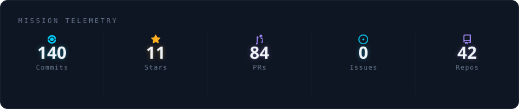

<!-- Final profile README template for luckstyle94.
     Use this content as README.md in github.com/luckstyle94/luckstyle94.
     SVGs are generated in assets/generated/. -->

  

 

  

 

  

 

  

 

<strong>About me</strong>

 

Cloud Infrastructure and Security Specialist with 10+ years in mission-critical environments.
Focused on secure AWS architecture, DevSecOps practices, and compliance-driven engineering.

Core areas:
- AWS Security and IAM Governance
- Terraform and secure Infrastructure as Code
- CI/CD security tooling (SAST, DAST, vulnerability scanning)
- Observability and centralized security visibility

Most production work is private due to security and compliance constraints.

**Currently at** VExpenses (Remote, Brazil)

 

  
  

